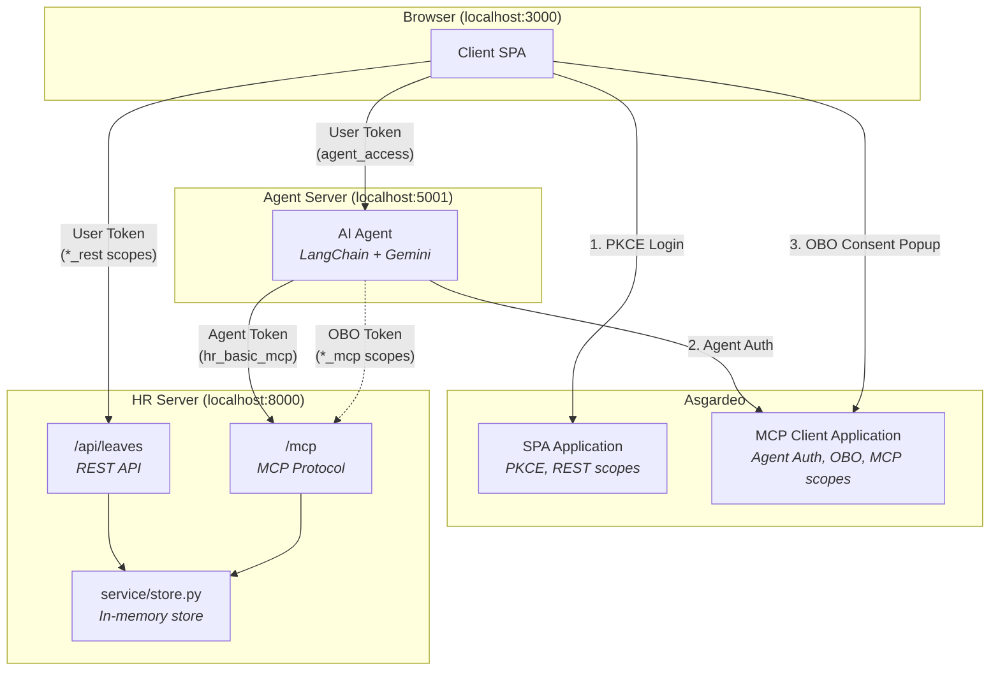

# Employee Portal

A sample application demonstrating **seven IAM patterns for AI agents** using [Asgardeo](https://asgardeo.io). An AI-powered Corporate Concierge handles HR leave management with fine-grained access control — from basic queries with the agent's own credentials, to elevated actions on behalf of individual users.

**Key difference from v1:** No internal employee IDs (like EMP001). Any Asgardeo user with the right role/permissions can use the system immediately. User identity comes directly from the JWT `sub` claim, and users are auto-registered on first interaction.

## Seven IAM Patterns

| Pattern | Description | Token Type | Example |
|---------|-------------|------------|---------|
| **1. Agent as Resource Server** | Client authenticates directly with Asgardeo, sends JWT to agent | User Token (PKCE) | Client calls `POST /api/chat` with Bearer token |
| **2. Agent as Autonomous Client** | Agent authenticates as itself for basic operations | Agent Token (App Native Auth) | Agent queries company holidays, leave policy |
| **3. Agent on Behalf of User** | Agent acts with user's elevated privileges via OBO token | OBO Token (Auth Code + Actor Token) | Agent applies leave, checks balance for user |
| **4. Agent Delegating to Agent** | One agent invokes another; each authorizes independently | Two Agent Tokens (caller + callee) | HR Agent asks the IT Agent about VPN, files an IT ticket |
| **5. Out-of-Band Approval (CIBA)** | Agent gets authorization from a human who is *not* in the session | OBO Token via CIBA (Agent Token as `actor_token`) | HR Admin approves a leave request on their phone |
| **6. Third-Party Delegated Access** | Agent calls an API at *another* identity provider, using a consent granted there | Google OAuth grant (refresh token, per user) | Agent writes an approved leave to the employee's Google Calendar |
| **7. Federated User → Agent** | A person authenticated by a *different* IdP uses an agent directly, with their own authority | User Token (federated) → OBO Token | A partner-org IT admin resolves tickets through the IT Agent |

Patterns 4 and 6 are **optional** and off by default:

- Pattern 4 — set `IT_AGENT_ENABLED=true` in `agent/.env`. See [Pattern 4: Agent-to-Agent](#pattern-4-agent-to-agent-delegation).
- Pattern 6 — set `GOOGLE_CALENDAR_ENABLED=true` in `agent/.env`. See [Pattern 6: Third-Party Delegated Access](#pattern-6-third-party-delegated-access-google-calendar).
- Pattern 7 — runs on top of Pattern 4's IT agent. See [Pattern 7: Federated Partner-Org Access](#pattern-7-federated-partner-org-access).

Patterns 1-3 are the core of the sample and always on.

## Architecture



**3 components**: Client SPA, Agent Server, HR Server (MCP + REST in one process). No database required — all business data is stored in-memory.

**Two action paths, one business layer.** Every leave action — apply, approve, reject — can be performed in two ways:
- **Manual UI** — the SPA calls REST endpoints on the HR server using the user's `*_rest` scopes from PKCE login.
- **Chat** — the SPA sends messages to the agent server, which calls MCP tools using the agent's `*_mcp` scopes (or OBO-elevated for user-specific actions).

Both paths execute the same `service/hr_service.py` functions, so behavior is identical regardless of which surface a user prefers.

**No SCIM2 identity resolution.** Unlike v1, there is no M2M application and no `GET /scim2/Users/{sub}` lookup. User identity comes directly from JWT claims (`sub` + `name`). Users are auto-registered with default leave balances on first interaction.

**Two Asgardeo applications** provide clean IAM separation:
- **SPA Application** — Browser authenticates via PKCE and receives tokens with `*_rest` scopes for direct REST API access (dashboard)
- **MCP Client Application** — Agent authenticates as a first-class identity (App Native Auth) and receives tokens with `*_mcp` scopes for MCP tool invocation. Also handles OBO flow when the agent needs to act on behalf of a user.

## Project Structure

```
smart-employee-agent/
├── client/                     # Browser SPA (port 3000)
│   ├── index.html              # Tabbed UI: Dashboard, Apply, Manage, Chat
│   ├── app.js                  # PKCE login, REST API client, chat, OBO popup
│   ├── styles.css              # Layout and styling
│   ├── serve.py                # Dev server with /config endpoint
│   └── .env.example
├── agent/                      # Agent Server (port 5001)
│   ├── main.py                 # FastAPI + LangChain + JWT validation
│   ├── session.py              # Per-user session store
│   ├── agent_auth.py           # Agent token management (App Native Auth)
│   ├── obo_flow.py             # OBO flow handling (PKCE + token exchange)
│   ├── ciba_flow.py            # CIBA initiation + polling — Pattern 5
│   ├── google_calendar.py      # Google OAuth + Calendar API — Pattern 6, optional
│   ├── requirements.txt
│   └── .env.example
├── it-agent/                   # IT Agent (port 5002) — Pattern 4, optional
│   ├── main.py                 # A2A guard + own LLM + own MCP client
│   ├── agent_auth.py           # IT Agent's OWN agent identity
│   ├── jwt_validator.py        # Validates the CALLING agent's token
│   ├── requirements.txt
│   └── .env.example
├── it-server/                  # IT MCP Server (port 8001) — Pattern 4, optional
│   ├── main.py                 # MCP app + /reset
│   ├── config.py
│   ├── mcp_server/server.py    # FastMCP app + 6 IT service-desk tools
│   ├── service/                # it_service.py + in-memory store
│   ├── auth/                   # jwt_validator, context, scopes
│   ├── requirements.txt
│   └── .env.example
└── hr-server/                  # HR Server: MCP + REST in one process (port 8000)
    ├── main.py                 # Composes MCP + REST and starts uvicorn
    ├── config.py               # Centralized env loading + ALLOWED_ORIGINS
    ├── mcp_server/
    │   └── server.py           # FastMCP app + 9 @mcp.tool definitions
    ├── rest_api/
    │   └── server.py           # REST routes: holidays, policy, balance, leaves CRUD, reset
    ├── service/
    │   ├── store.py            # In-memory state, seed data, ensure_user
    │   └── hr_service.py       # Business logic shared by MCP + REST
    ├── auth/
    │   ├── jwt_validator.py    # JWT validation via JWKS
    │   ├── context.py          # Per-request context vars (sub, scopes, ...)
    │   └── scopes.py           # require_scope / require_user / audit helpers
    ├── requirements.txt
    └── .env.example
```

## Prerequisites

- Python 3.10+
- An [Asgardeo](https://asgardeo.io) account (free tier works)
- A [Google AI Studio](https://aistudio.google.com/) API key (for Gemini LLM)

---

## Asgardeo Configuration

### Step 1: Create API Resources

#### REST API Resources (for SPA)

**Agent API Resource** (REST)
- Identifier: `agent-api`
- Scopes: `agent_access`

**HR REST API Resource**
- Identifier: `hr-rest-api`
- Scopes:

| Scope | Description |
|-------|-------------|
| `hr_basic_rest` | Company holidays, leave policy |
| `hr_self_rest` | Own leave balance and requests for dashboard |
| `hr_read_rest` | All leave requests for dashboard |
| `hr_approve_rest` | Role marker for HR Admin |

#### MCP Resources (for Agent)

**HR MCP Resource**
- Identifier: `hr-mcp`
- Scopes:

| Scope | Description |
|-------|-------------|
| `hr_basic_mcp` | Company holidays, leave policy |
| `hr_self_mcp` | Own leave balance, own leave requests, apply for leave |
| `hr_read_mcp` | All leave requests, leave request details |
| `hr_approve_mcp` | Approve/reject pending leave requests |

### Step 2: Register an AI Agent

Agents in Asgardeo are first-class identities (like users) — not OAuth clients.

1. Go to **Console > Agents**
2. Click **+ New Agent**
3. Provide a name (e.g., "Corporate Concierge") and optional description
4. Click **Create**

You will receive:
- **Agent ID** → used in `agent/.env` as `AGENT_ID`
- **Agent Secret** (shown once — store securely) → used in `agent/.env` as `AGENT_SECRET`

### Step 3: Create an SPA Application (for Browser)

The SPA handles browser PKCE login and dashboard REST access.

1. Go to **Applications > New Application > Single-Page Application**
2. Provide a name (e.g., "Smart Employee Client")
3. Authorized redirect URL: `http://localhost:3000/callback`
4. Finish the wizard
5. Under **API Authorization**, subscribe to the REST API Resources:
   - `agent-api` (grant `agent_access`)
   - `hr-rest-api` (grant all: `hr_basic_rest`, `hr_self_rest`, `hr_read_rest`, `hr_approve_rest`)
6. **Configure User Attributes:**
   - Navigate to the **User Attributes** section of the application
   - Under the **profile** section, ensure `given_name` and `family_name` are selected as **Requested** and **Mandatory**
7. **Configure Access Token:**
   - Navigate to the **Protocol** tab → **Access Token** section
   - Set **Token Type** to **JWT**
   - Under the **Access Token Attributes** dropdown, select `given_name` and `family_name`
8. Note the **SPA Client ID** → used in:
   - `client/.env` as `CLIENT_ID`
   - `agent/.env` as `TOKEN_AUDIENCE` (for validating user JWTs)
   - `hr-server/.env` as `SPA_CLIENT_ID`

### Step 4: Create an MCP Client Application (for Agent)

The MCP Client handles agent authentication (App Native Auth) and OBO flow.

1. Go to **Applications > New Application > MCP Client Application**
2. Provide a name (e.g., "Employee Portal")
3. Authorized redirect URL: `http://localhost:5001/api/obo/callback`
4. Finish the wizard
5. Under **API Authorization**, subscribe to the MCP Resources:
   - `hr-mcp` (grant all: `hr_basic_mcp`, `hr_self_mcp`, `hr_read_mcp`, `hr_approve_mcp`)
6. **Configure User Attributes:**
   - Navigate to the **User Attributes** section of the application
   - Under the **profile** section, ensure `given_name` and `family_name` are selected as **Requested** and **Mandatory**
7. **Configure Access Token:**
   - Navigate to the **Protocol** tab → **Access Token** section
   - Set **Token Type** to **JWT**
   - Under the **Access Token Attributes** dropdown, select `given_name` and `family_name`
8. Note the **MCP Client ID** → used in:
   - `agent/.env` as `ASGARDEO_CLIENT_ID`
   - `hr-server/.env` as `CLIENT_ID`

### Step 5: Create Roles

| Role | REST Scopes (SPA) | MCP Scopes (Agent/OBO) |
|------|-------------------|----------------------|
| `employee` | `agent_access`, `hr_basic_rest`, `hr_self_rest` | `hr_basic_mcp`, `hr_self_mcp` |
| `hr_admin` | All employee scopes + `hr_read_rest`, `hr_approve_rest` | All employee + `hr_read_mcp`, `hr_approve_mcp` |

### Step 6: Create Demo Users

Create any number of users in your Asgardeo organization and assign them the appropriate role. **No specific usernames required** — any user with the right role will work immediately.

| Example User | Role | What They Can Do |
|-------------|------|------------------|
| Any user | `employee` | View holidays/policy, check own balance, apply for leave |
| Any user | `hr_admin` | Everything an employee can do + view all requests, approve/reject |

> **No identity linking needed.** Users are auto-registered on first interaction with default leave balances (Annual: 20, Sick: 10, Personal: 5).

---

## Setup & Run

### 1. HR Server (Terminal 1)

```bash
cd hr-server
python3 -m venv .venv && source .venv/bin/activate
pip install -r requirements.txt

cp .env.example .env
# Edit .env:
#   AUTH_ISSUER=https://api.asgardeo.io/t/<tenant>/oauth2/token
#   CLIENT_ID=<mcp-client-app-client-id>
#   SPA_CLIENT_ID=<spa-app-client-id>
#   JWKS_URL=https://api.asgardeo.io/t/<tenant>/oauth2/jwks

python main.py   # Runs on port 8000
```

### 2. Agent Server (Terminal 2)

```bash
cd agent
python3 -m venv .venv && source .venv/bin/activate
pip install -r requirements.txt

cp .env.example .env
# Edit .env:
#   ASGARDEO_BASE_URL=https://api.asgardeo.io/t/<tenant>
#   ASGARDEO_CLIENT_ID=<mcp-client-app-client-id>
#   AGENT_ID=<agent-id-from-console-agents>
#   AGENT_SECRET=<agent-secret-from-console-agents>
#   TOKEN_AUDIENCE=<spa-app-client-id>
#   OBO_REDIRECT_URI=http://localhost:5001/api/obo/callback
#   JWKS_URL=https://api.asgardeo.io/t/<tenant>/oauth2/jwks
#   AUTH_ISSUER=https://api.asgardeo.io/t/<tenant>/oauth2/token
#   GOOGLE_API_KEY=<your-google-api-key>

python main.py   # Runs on port 5001
```

### 3. Client (Terminal 3)

```bash
cd client
pip install python-dotenv   # Only dependency

cp .env.example .env
# Edit .env:
#   ASGARDEO_BASE_URL=https://api.asgardeo.io/t/<tenant>
#   CLIENT_ID=<spa-app-client-id>

python serve.py   # Runs on port 3000
```

### 4. Open the App

Go to **http://localhost:3000**. Click "Sign In" and log in with any Asgardeo user that has the `employee` or `hr_admin` role.

---

## Usage

The app has **four tabs**:

| Tab | Visible to | Purpose |
|---|---|---|
| **Dashboard** | Everyone | Stat cards (balance for employees, status counts for admins), upcoming holidays, leaves table with filters. Row click opens a details drawer. |
| **Apply for Leave** | `hr_self_rest` | Form with leave-type dropdown, date pickers, reason. Live summary shows requested days plus warnings if notice period or balance would be violated. |
| **Manage Requests** | `hr_approve_rest` | Pending queue with inline ✓ Approve / ✗ Reject buttons. Reject opens a reason modal. Tab badge shows the pending count. |
| **Chat** | Everyone | Conversational AI Assistant. Backed by the agent server + MCP tools, with the OBO popup for elevated actions. |

Manual actions (tabs 1–3) call the **REST API** with the SPA's `*_rest` scopes. Chat (tab 4) calls the **agent server**, which uses the MCP tools with `*_mcp` scopes via OBO. Both paths invoke the same `service/hr_service.py` business logic.

### Basic Queries (Agent Token — No OBO Needed)

These work immediately with the agent's own `hr_basic_mcp` credentials:

- "What are the company holidays this year?"
- "What is the leave policy?"

### Elevated Actions (OBO Required)

When you ask something that requires the user's own scopes, the agent returns an **"Authorize"** button:

- "What is my leave balance?" → needs `hr_self_mcp`
- "Apply for 5 days annual leave March 10-14" → needs `hr_self_mcp`
- "Show my leave requests" → needs `hr_self_mcp`

Click **Authorize Me** → popup opens → consent → popup closes → agent retries with OBO token.

### Role-Specific Actions

**As an Employee:**
- "What is my leave balance?" → shows default 20/10/5
- "Apply for sick leave March 5-6, not feeling well" → creates LR001
- "Show my leave requests" → lists own requests

**As an HR Admin:**
- "Show all pending leave requests" → lists all org requests
- "Get details for LR001" → full request details
- "Approve leave request LR001" → approves, deducts balance
- "Reject LR002 — insufficient notice" → rejects with reason

### Role Limitations

If a user tries an action beyond their role, the agent explains politely:
- Employee asks "Approve leave LR001" → agent explains Employee role can't approve

---

## MCP Tools (9 tools)

| Tool | MCP Scope | Identity | Token |
|------|-----------|----------|-------|
| `get_company_holidays` | `hr_basic_mcp` | No | Agent |
| `get_leave_policy` | `hr_basic_mcp` | No | Agent |
| `get_my_leave_balance` | `hr_self_mcp` | Yes | OBO |
| `get_my_leave_requests` | `hr_self_mcp` | Yes | OBO |
| `apply_leave` | `hr_self_mcp` | Yes | OBO |
| `get_all_leave_requests` | `hr_read_mcp` | No | OBO |
| `get_leave_request_details` | `hr_read_mcp` | No | OBO |
| `approve_leave_request` | `hr_approve_mcp` | Yes | OBO |
| `reject_leave_request` | `hr_approve_mcp` | Yes | OBO |

---

## REST API (used by the manual UI)

These are the REST endpoints exposed by `hr-server` for the SPA. The browser calls them directly with its PKCE-issued SPA token; no OBO required.

| Method | Path | Required scope | Purpose |
|---|---|---|---|
| `GET`  | `/api/holidays`                    | `hr_basic_rest` | Company holidays |
| `GET`  | `/api/leave-policy`                | `hr_basic_rest` | Leave types and rules |
| `GET`  | `/api/leave-balance`               | `hr_self_rest` | Caller's own balance |
| `GET`  | `/api/leaves`                      | `hr_self_rest` \| `hr_read_rest` | Caller's leaves (employee) or all leaves with filters (admin) |
| `GET`  | `/api/leaves/{id}`                 | `hr_self_rest` (own) \| `hr_read_rest` (any) | Leave details |
| `POST` | `/api/leaves`                      | `hr_self_rest` | Apply for leave |
| `POST` | `/api/leaves/{id}/approve`         | `hr_approve_rest` | Approve a pending request |
| `POST` | `/api/leaves/{id}/reject`          | `hr_approve_rest` | Reject a pending request |
| `POST` | `/reset`                           | `hr_approve_rest` \| `hr_approve_mcp` | Reset all in-memory data (demo only) |

The `hr_approve_rest` scope is granted to the `hr_admin` role per the Asgardeo configuration above. Employee tokens never receive it, so approve/reject actions return HTTP 403 from the REST surface.

---

## Test Checklist

### Authentication Tests

| # | Test | Expected |
|---|------|----------|
| 1 | PKCE login (Employee) | Login succeeds, role badge shows "Employee" (green) |
| 2 | PKCE login (HR Admin) | Login succeeds, role badge shows "HR Admin" (blue) |
| 3 | Sign out | Returns to login overlay, clears token |

### Dashboard Tests

| # | Test | User | Expected |
|---|------|------|----------|
| 4 | Dashboard loads | Employee | Shows "My Leave Requests" (own data only) |
| 5 | Dashboard loads | HR Admin | Shows "All Leave Requests" (all employees) |
| 6 | Dashboard refresh | Any | After a chat action, dashboard updates automatically |

### Basic Chat (Agent Token — No OBO)

| # | Test | Expected |
|---|------|----------|
| 7 | "What are the company holidays?" | Returns list of holidays (no authorize button) |
| 8 | "What is the leave policy?" | Returns leave type rules |

### OBO Flow Tests

| # | Test | Expected |
|---|------|----------|
| 9 | Ask "my leave balance" (first time) | "Authorize Me" button appears |
| 10 | Click Authorize → consent | Popup closes → agent retries → shows balance (20/10/5) |
| 11 | Ask "apply for sick leave Mar 5-6" | Works without re-authorization |
| 12 | Multiple elevated requests | All work without re-authorization |

### Employee Role Tests

| # | Test | Expected |
|---|------|----------|
| 13 | "What is my leave balance?" | Shows annual: 20, sick: 10, personal: 5 |
| 14 | "Show my leave requests" | Shows own requests |
| 15 | "Apply for personal leave March 20-21 for moving" | Creates new leave request (LR001) |
| 16 | "Approve leave LR001" | **Role limitation**: agent explains Employee can't approve |

### HR Admin Tests

| # | Test | Expected |
|---|------|----------|
| 17 | "Show all pending leave requests" | Returns all pending requests across org |
| 18 | "Get details for LR001" | Returns full details including employee name |
| 19 | "Approve leave request LR001" | Approves, records reviewer, deducts balance |
| 20 | "Reject LR002 — insufficient notice" | Rejects with reason |

### Error & Reset Tests

| # | Test | Expected |
|---|------|----------|
| 21 | Chat without login | 401 → auto sign-out |
| 22 | Empty message | Error: "Message cannot be empty" |
| 23 | Click "Reset Data" | Resets all in-memory data → signs out → fresh start |

### Pattern 6 Tests (Google Calendar)

Requires `GOOGLE_CALENDAR_ENABLED=true`.

| # | Test | User | Expected |
|---|------|------|----------|
| 24 | User menu with Google disabled | Any | No "Connect Google Calendar" item |
| 25 | Connect Google Calendar | Employee | Popup → consent → item flips to "Disconnect" |
| 26 | Admin approves the employee's leave | HR Admin | Event lands on the **employee's** calendar, not the admin's |
| 27 | Approve for an employee who never connected | HR Admin | Approval succeeds; agent reports it could not sync |
| 28 | Multi-day leave (10th-12th) | Employee | Event covers all three days (Google's end date is exclusive) |
| 29 | Disconnect, then approve again | Employee | No event; approval still succeeds |
| 30 | Revoke at myaccount.google.com, then approve | Employee | Agent reports the refresh failed, approval still succeeds |

---

## Pattern 4: Agent-to-Agent Delegation

Two agents, two identities, two independent authorization decisions. The HR
Agent handles everything; when a question is about IT, it delegates to a
separate IT Agent that owns its own MCP server.

```
User ──consent──> HR Agent ──HR agent token──> HR MCP   (hr_basic_mcp)
                     │
                     │  ask_it_agent tool
                     │  presents the HR Agent's OWN token
                     │  (must carry it_agent_invoke)
                     ▼
                  IT Agent ──IT agent token──> IT MCP   (it_basic_mcp, it_ticket_mcp)
```

### What this demonstrates

- **Invoking an agent is itself a permission.** The IT Agent refuses any caller
  whose token lacks `it_agent_invoke`, and refuses non-agent callers outright
  (`aut != AGENT`), so a user token can never reach it even if it somehow
  carried the scope.
- **Neither agent can use the other's tools.** The HR Agent's token has no
  `it_*` scopes, so pointing it straight at the IT MCP server fails with
  `insufficient_scope`. Delegation is the only path, and it goes through an
  identity that is separately authorized.
- **Separate blast radius.** Compromising the HR Agent yields no IT access
  beyond what `it_agent_invoke` allows — which is "ask the IT Agent", not "use
  IT tools".

### The trade-off (read this)

On the HR → IT hop the **user is context, not authority**. The IT Agent acts on
its own identity, so the user's name and `sub` are forwarded as unverified data
used for wording and the ticket's `requested_for` field. The IT MCP server
authorizes the *agent*, never the user.

That is a deliberate choice, and it has a real consequence: the IT Agent can
file a ticket naming anyone. It fits a service-desk agent acting for the whole
org, and it is what the current SDK supports — `AsgardeoTokenClient.get_token()`
implements only `authorization_code` and `refresh_token`, with no
`urn:ietf:params:oauth:grant-type:token-exchange`. A nested delegation chain
(`sub`=user, `act`=IT Agent, `act.act`=HR Agent) would carry the user's authority
across both hops, but is not reachable through the SDK today.

If you need the user's authority on the second hop, do not use this pattern
as-is — give the IT MCP tools user-scoped guards and propagate a real delegated
token instead.

### Asgardeo configuration

On top of the Pattern 1-3 setup:

1. **API Resource** — "IT Service API", identifier `it_service_api`, scopes:
   `it_basic_mcp`, `it_ticket_mcp`.
2. **API Resource** — "Agent Invocation API", identifier `agent_invocation_api`,
   scope: `it_agent_invoke`.
3. **Authorize both** on the existing **MCP Client Application** (API
   Authorization tab). Role permission alone is not enough — the application
   must also be allowed to request the scope.
4. **Register a second agent**: Console > Agents > New Agent, "IT Agent".
   Copy its Agent ID and Secret into `it-agent/.env` as `IT_AGENT_ID` /
   `IT_AGENT_SECRET`.
5. **Roles**:
   - HR Agent's role gains `it_agent_invoke`.
   - New role `it_agent` with `it_basic_mcp` + `it_ticket_mcp`, assigned to the
     IT Agent.

> After changing roles or permissions, **restart the agent that holds the
> token**. Agent tokens are cached for their full lifetime (~1 hour), so a
> running process keeps presenting its pre-change token until it expires.

### Run it

```bash
# Terminal 4 — IT MCP server
cd it-server
python3 -m venv .venv && source .venv/bin/activate
pip install -r requirements.txt
cp .env.example .env      # AUTH_ISSUER, JWKS_URL, CLIENT_ID (same MCP client app)
python main.py            # Runs on port 8001

# Terminal 5 — IT agent
cd it-agent
python3 -m venv .venv && source .venv/bin/activate
pip install -r requirements.txt
cp .env.example .env      # IT_AGENT_ID, IT_AGENT_SECRET, GOOGLE_API_KEY, ...
python main.py            # Runs on port 5002
```

Then in `agent/.env` set `IT_AGENT_ENABLED=true` and restart the HR agent.

### Try it

| Ask the chat | What should happen |
|---|---|
| "What are the upcoming holidays?" | HR tools only — the IT Agent is never called |
| "Is the VPN working?" | HR Agent delegates; IT Agent reports the VPN as Degraded |
| "What software can I request?" | IT Agent returns the catalog with approval rules |
| "Raise a ticket, my laptop won't boot" | IT Agent files a ticket, reports the `IT00x` reference |
| "How many leave days do I have?" | Still HR + OBO — delegation does not affect Pattern 3 |

### Seeing tickets in the UI

An **IT Tickets** tab appears in the Concierge once the IT Agent is reachable.
It shows every ticket with the audit trail intact — who it was raised for, and
which agent actually filed it:

| Ref | Subject | Status | Requested for | Filed by |
|-----|---------|--------|---------------|----------|
| IT002 | Laptop won't boot | Open | John | IT Agent 709a00cc-… (requested by John) |

The tab reveals itself automatically: `GET /api/it/tickets` returns 404 when
`IT_AGENT_ENABLED=false`, so there is no extra client-side configuration.

The read follows the same authority chain as chat, minus the LLM:

```
Browser ──user JWT──> Agent /api/it/tickets     (Pattern 1: user token validated)
Agent   ──agent token──> IT Agent /api/tickets  (Pattern 4: it_agent_invoke checked)
IT Agent ──agent token──> IT MCP                (it_ticket_mcp checked)
```

The browser's token is never forwarded past the HR agent. Raise a ticket in the
chat, then hit Refresh on the tab to watch it appear.

### Reading the logs

Each hop names itself, so a single question is traceable across four processes:

```
# HR agent
[CHAT >> Agent Token] user(sub)=... | scopes=hr_basic_mcp openid it_agent_invoke
[A2A >> IT Agent] requester=Lashini | query='is the VPN down?'

# IT agent
[A2A >> Caller Agent] agent(sub)=<hr-agent-uuid> | scopes=... it_agent_invoke
[IT-AGENT >> Agent Token] sub=(self) | scopes=it_basic_mcp it_ticket_mcp openid

# IT MCP
[IT-MCP >> Agent Token] sub=<it-agent-uuid> | aut=AGENT | scopes=it_basic_mcp, ...

# HR agent again
[A2A << IT Agent] tools_used=['get_service_status']
```

Denials are equally explicit:

```
[A2A DENIED] caller agent=<uuid> lacks 'it_agent_invoke' | present=['hr_basic_mcp', 'openid']
[SCOPE DENIED] Required: 'it_ticket_mcp' | Present: ['hr_basic_mcp', 'openid']
```

## Pattern 6: Third-Party Delegated Access (Google Calendar)

When an HR Admin approves a leave request, the agent writes the leave onto the
**employee's own Google Calendar**. Off by default — set
`GOOGLE_CALENDAR_ENABLED=true` in `agent/.env`.

Patterns 1-5 all take place inside one trust domain: Asgardeo issues every
token, and every server validates against the same JWKS. Pattern 6 is the first
time the agent leaves that domain, and the interesting part is what does *not*
carry across.

```
HR Admin ──OBO token (hr_approve_mcp)──> HR MCP     approve LR001   [Asgardeo]
                                            │
                                            ▼
Agent ──employee's Google refresh token──> Google Calendar API      [Google]
```

### What this demonstrates

- **Authority does not cross providers.** Asgardeo has no authority over
  Google. An HR Admin holding every scope in the tenant still cannot put an
  entry on someone's calendar — that permission exists only at Google, and only
  the employee can grant it.
- **The trigger and the authority are different identities.** The *admin's*
  Asgardeo authority approves the leave. The *employee's* Google grant writes
  the calendar entry. The agent holds both and must pick the right one; it
  looks the employee up by the `employee_sub` the HR server returns with the
  approval, and never falls back to the admin's grant.
- **Separate consent, separate revocation.** The employee grants calendar
  access in a second popup that has nothing to do with the OBO consent, and
  revokes it at
  [myaccount.google.com/permissions](https://myaccount.google.com/permissions)
  without touching Asgardeo. Disconnecting in the user menu drops the agent's
  copy of the grant; revoking at Google kills it everywhere.
- **Least privilege at the third party too.** The agent requests
  `calendar.events` — enough to add an entry, not to read the employee's
  calendar.
- **The external call cannot fail the business action.** A calendar error never
  turns a successful approval into a failed one; it is reported alongside it.

### Google Cloud setup

> Google replaced the old **OAuth consent screen** page with the **Google Auth
> Platform**. Its settings now live under four sections — Branding, Audience,
> Data Access, and Clients — so older guides pointing at "OAuth consent screen"
> no longer match the console.

1. **APIs & Services > Library** — enable the **Google Calendar API**.
2. **Google Auth Platform** ([/auth/overview](https://console.cloud.google.com/auth/overview))
   — if this project has never been configured, complete the **Get started**
   wizard: app name, support email, then **Audience**.
   - Set the audience to **External** so any Google account can consent.
   - On a personal `@gmail.com` account **Internal is not offered** — the app is
     External by definition and no choice appears. That is expected.
3. **Data Access** ([/auth/scopes](https://console.cloud.google.com/auth/scopes))
   — **Add or remove scopes**, then add
   `https://www.googleapis.com/auth/calendar.events`.
4. **Audience** ([/auth/audience](https://console.cloud.google.com/auth/audience))
   — while publishing status is **Testing**, add every demo employee's Google
   account under **Test users**. Consent is refused for anyone not listed, and
   this is the most common setup failure.
5. **Clients** ([/auth/clients](https://console.cloud.google.com/auth/clients))
   — **Create client > Web application**, with the authorized redirect URI
   `http://localhost:5001/api/google/callback` (exact match, no trailing slash).
6. Copy the client ID and secret into `agent/.env`:

```bash
GOOGLE_CALENDAR_ENABLED=true
GOOGLE_CLIENT_ID=<google-oauth-client-id>
GOOGLE_CLIENT_SECRET=<google-oauth-client-secret>
GOOGLE_REDIRECT_URI=http://localhost:5001/api/google/callback
```

> No Asgardeo configuration is needed for this pattern — which is the point.

### Try it

The employee connects Google **once**, then an admin's approval syncs
automatically.

| Step | As | Action | What should happen |
|---|---|---|---|
| 1 | Employee | User menu → **Connect Google Calendar** | Google popup → consent → "Connected" |
| 2 | Employee | "Apply for 3 days annual leave from the 10th" | Creates LR001 (OBO consent if not yet given) |
| 3 | HR Admin | "Approve LR001" in chat | Approved, **and** the entry appears on the *employee's* calendar |
| 4 | Employee | Check Google Calendar | All-day event "Annual Leave — <name>" spanning the full range |
| 5 | Employee | User menu → **Disconnect Google Calendar** | Grant dropped; a later approval reports it could not sync |

The agent syncs on both approval routes: a direct approval in chat (above) and
an out-of-band CIBA approval (Pattern 5), where the employee is the one in the
chat and the admin approves on their phone.

### Reading the logs

```
# The Asgardeo hop — the admin's delegated authority
[CHAT >> OBO Token] user(sub)=<admin-uuid> | scopes=hr_approve_mcp openid
[AUDIT] Leave LR001 approved by Agent <agent-uuid> on behalf of Alice Admin

# The Google hop — the EMPLOYEE's authority, not the admin's
[GOOGLE >> Calendar] event created id=... 2026-09-10..2026-09-13 (end exclusive)
[GOOGLE >> Calendar] synced LR001 to employee(sub)=<employee-uuid> | approved in-session by <admin-uuid>
```

When the employee never connected Google, the approval still stands and the
agent says so rather than failing:

```
[GOOGLE] no active session for employee(sub)=<employee-uuid> — nothing to sync
```

### Limits (read this)

- **Grants live in memory**, alongside the session, and are lost when the agent
  restarts — the employee reconnects. A real deployment stores refresh tokens
  encrypted and keyed by user, out of process.
- **The employee needs an active agent session.** The grant is held per session,
  so an employee who has not talked to the agent in this process has nothing for
  the admin's approval to find. Fine for a demo; a real system reads the grant
  from that persistent store instead.
- **The manual "Manage Requests" tab does not sync.** Those approvals go
  browser → HR REST and never touch the agent, so there is no agent holding the
  Google grant. Only chat approvals sync — which is honest about *who* is
  calling the external API.
- **`prompt=consent` is forced** on every authorization, because Google
  withholds the refresh token from a returning user otherwise, and a grant
  without one dies in an hour.
- **Refresh tokens expire after 7 days while the app is in Testing.** Google
  issues short-lived refresh tokens to unverified External apps, so a demo
  environment left idle for a week fails the next sync with `invalid_grant` and
  the employee must reconnect. Grants are lost on restart here anyway, so this
  seldom shows up — an **Internal** audience (Workspace orgs only) avoids it
  entirely, as does publishing the app.

## Pattern 7: Federated Partner-Org Access

Patterns 1–6 all assume the person using an agent belongs to *your*
organization. This one does not.

**The scenario:** the IT service desk is outsourced. The engineers who work the
ticket queue are staff of a partner company, with accounts in that company's
own identity provider. Your organization never creates their accounts, never
resets their passwords, and never offboards them — yet they must work your
tickets every day.

### What this demonstrates

- **Lifecycle stays with the home organization.** Disable an engineer in the
  partner's directory and they lose access here immediately, with no action
  taken locally and no orphaned account left behind. This is the property that
  local accounts cannot give you, and it is the clearest argument for
  federation.
- **The agents never learn about the second IdP.** Federation resolves at the
  identity provider, so both agents keep receiving ordinary first-party tokens
  and their validation is unchanged. That is the architectural win — and the
  demo problem, since it makes the second provider invisible. The sample
  therefore surfaces the origin deliberately (a badge in the UI, `home_org` in
  every log line) and lets it appear in the audit trail of every action.
- **Two inbound paths, two kinds of authority.** The IT Agent now answers on
  both, and the guards are exact mirror images:

  | Path | Caller | Guard | Acts as |
  |---|---|---|---|
  | `/api/ask`, `/api/tickets` | another agent | must be `aut=AGENT` + `it_agent_invoke` | itself (Pattern 4) |
  | `/api/desk/*` | a person | must **not** be `aut=AGENT`, needs `it_desk_access` | **the user**, via OBO |

  Neither path is reachable with the other's token, so which authority applies
  is never ambiguous.
- **The user's own permissions decide the outcome.** On the desk path the agent
  obtains a delegated token (`sub` = the person, `act.sub` = the IT Agent) and
  calls the IT MCP server with it. The server authorizes *the human*. It never
  falls back to the agent's own token — that would silently answer with the
  agent's permissions instead of the user's.
- **A real privilege boundary.** Closing a ticket needs `it_resolve_mcp`, which
  ordinary employees do not have. An employee asking to resolve a ticket is
  refused by the resource server, not by prompt wording. That same scope also
  controls whole-queue visibility: without it you see only tickets raised for
  you, and no name you type widens that.

### Asgardeo configuration

On top of the Pattern 4 setup:

1. **Partner tenant** — create a second Asgardeo organization for the partner,
   then register a **Standard-Based Application (OpenID Connect)** in it. This
   app is what makes the *primary* tenant an OIDC client of the partner.
   - **Grant type:** Authorization Code (the only one needed).
   - **Authorized redirect URL:**
     `https://api.asgardeo.io/t/<primary-tenant>/commonauth`
     Note this is the **primary** tenant's URL, not the partner's — the partner
     authenticates the user and hands them back to the broker. Use the same
     value for the logout redirect if you want single logout.
   - Keep it confidential (client secret). Do not mark it a public client or
     force PKCE; the primary tenant authenticates with the secret.
   - **User Attributes:** share `given_name`, `family_name`, `email` and
     `groups`. Without `groups` the role mapping below has nothing to match,
     and engineers sign in successfully but with no permissions.
2. **Primary tenant → Connections** — add an OIDC/Enterprise connection
   pointing at the partner tenant's endpoints, using that application's client
   ID and secret.
3. **Add the connection to the SPA's login flow**, so the sign-in page offers
   "Sign in with the partner organization".
4. **Enable JIT provisioning** on the connection, so federated users
   materialize locally and can hold roles.
5. **New scopes** on the existing IT API resources:
   - `it_resolve_mcp` on the IT Service API — closing tickets, and whole-queue
     visibility.
   - `it_desk_access` on the Agent API resource — permission to use the service
     desk at all.
6. **Roles:**

   | Role | Assigned to | IT scopes |
   |---|---|---|
   | `employee` | local staff | `it_desk_access`, `it_basic_mcp`, `it_ticket_mcp` |
   | `it_service_desk` | federated partner users | the above **plus** `it_resolve_mcp` |

   Map the partner directory's group onto `it_service_desk` so engineers get
   their permissions on first login without anyone provisioning them by hand.
7. **Register the desk callback** — add
   `http://localhost:5002/api/desk/obo/callback` to the MCP Client
   Application's redirect URIs, and set it as `IT_REDIRECT_URI` in
   `it-agent/.env`. Unlike Pattern 4 this is a real browser redirect.

Also set `SPA_CLIENT_ID` in `it-agent/.env`: browser tokens are minted for the
SPA and agent tokens for the MCP client app, so the IT agent accepts both
audiences and tells them apart by `aut`.

### Try it

| Step | As | Action | What should happen |
|---|---|---|---|
| 1 | Employee | Ask the assistant to raise an IT ticket | Ticket filed via the HR → IT delegation (Pattern 4) |
| 2 | Partner engineer | Sign in with the partner organization | Redirects to the **partner tenant's** login page, returns authenticated |
| 3 | Partner engineer | Open **IT Service Desk** | Badge reads "Signed in via … (partner org)" |
| 4 | Partner engineer | Send a message → **Authorize** | Consent popup; afterwards the agent acts with their permissions |
| 5 | Partner engineer | "Show open tickets", then "resolve IT001, replaced the SSD" | Whole queue visible; ticket closes |
| 6 | Employee | Open the desk and try to resolve a ticket | Refused for lack of `it_resolve_mcp`; sees only their own tickets |
| 7 | Partner admin | Disable the engineer in the **partner tenant**, retry sign-in | Access gone, with nothing changed locally |

Step 7 is the payoff, and it needs no code at all.

### Reading the logs

```
# a person on the desk path — note home_org
[DESK >> User Token] user(sub)=... | name=Priya Raj | home_org=HelixIT | scopes=it_desk_access openid
[IT-OBO] delegated authority granted by user(sub)=... from home_org=HelixIT | scopes=['it_basic_mcp', 'it_ticket_mcp', 'it_resolve_mcp']
[DESK >> OBO Token] acting as user(sub)=... | home_org=HelixIT | scopes=it_basic_mcp, it_ticket_mcp, it_resolve_mcp

# the IT MCP server sees the human, with the agent as actor
[IT-MCP >> OBO Token] user(sub)=... | home_org=HelixIT | agent(act.sub)=<it-agent-uuid> | scopes=...
[AUDIT] IT001 resolved by user(sub)=... from home_org=HelixIT
```

Denials name which guard fired:

```
[DESK DENIED] agent token presented on the human path
[DESK DENIED] user=<uuid> lacks 'it_desk_access' | present=['openid']
[SCOPE DENIED] Required: 'it_resolve_mcp' | Present: ['it_basic_mcp', 'it_ticket_mcp']
[IT-MCP] queue scoped to own tickets for user(sub)=<uuid> | 1 ticket(s)
```

### Limits (read this)

- **The home-organization claim is best-effort.** Asgardeo names it differently
  depending on how the user authenticated, so the code checks several claims in
  order and falls back to `primary`. Confirm against a real federated token in
  your tenant before relying on a specific claim.
- **Sessions and delegated tokens are in memory**, lost on restart. A real
  deployment persists them encrypted, keyed by user.
- **Tickets carry an owning organization but the demo does not host two
  customer orgs.** If you extend this to a partner serving several customers,
  enforce that dimension on read as well, or engineers will see across
  customers.
- **Federation is configured, not coded.** Nothing in either agent knows the
  partner IdP exists. If you want the agent itself to validate foreign tokens,
  that is a different design (multi-issuer validation) with different
  trade-offs.

## Seeing the tokens

The tokens themselves are never logged and never reach the browser — a delegated
token lives only in the agent process's memory. What the logs show is the
decoded claims, which is what a resource server actually authorizes on.

Every MCP call prints one line naming the kind of token that carried it:

```
[MCP >> OBO Token]   user(sub)=<user-uuid> | name=Nimal Perera | agent(act.sub)=<agent-uuid> | scopes=hr_self_mcp openid
[MCP >> Agent Token] sub=<agent-uuid> | name=... | scopes=hr_basic_mcp openid
```

Same server, same tools, different authority — and only the first has an `act`
claim. That contrast is Pattern 3 in one screen.

For a fuller view, set `DEBUG_TOKENS=true` in any component's `.env` and
restart it. Each token is then printed with its claims broken out:

```
╭─ [IT-MCP] OBO Token ────────────────────────────────────────────
│ DELEGATED — a person's authority, carried by an agent
│   sub      = 8f2a-user-uuid   (whose authority)
│   act.sub  = c41b-it-agent-uuid   (who is carrying it)
│ scopes     = it_basic_mcp it_ticket_mcp it_resolve_mcp openid
│ audience   = <mcp-client-id>
│ issuer     = https://api.asgardeo.io/t/<tenant>/oauth2/token
│ expires    = 2026-08-31T11:57:58+00:00 (in 59m 59s)
│ other claims:
│   { "family_name": "Raj", "given_name": "Priya", "idp": "HelixIT" }
╰──────────────────────────────────────────────────────────────────
```

### Getting the actual token

`DEBUG_TOKENS=true` prints claims only. To get the encoded JWT itself — to
paste into jwt.io and show the `act` claim on screen — set
`DEBUG_TOKENS_RAW=true` instead. It implies `DEBUG_TOKENS`, and prints the
token unwrapped on its own line so it can be copied in one go:

```
  encoded token (CREDENTIAL — do not share, expires soon):
eyJhbGciOiJSUzI1NiIsIn...
```

> **This writes a live bearer token to the log.** Anyone who reads that log —
> or a screenshot of it, or a pasted terminal dump — can replay the token until
> it expires. Use it on a throwaway tenant and turn it off afterwards. The
> component logs a warning on startup while it is on, so you cannot forget
> quietly.

Both default to false. Enable on:

| Component | Shows |
|---|---|
| `hr-server` | every HR tool call, agent vs. delegated |
| `it-server` | every IT tool call, including `home_org` for federated users |
| `agent` | its own agent token at startup/refresh, the actor token, and the delegated token at consent |
| `it-agent` | the same three, for its own separate agent identity |

The agent-side dumps are worth watching in order. The agent's **own** token has
no `act` claim — it is acting as itself. The **actor** token is that same
identity being presented during the exchange, and its `sub` reappears as
`act.sub` in the **delegated** token that comes back. Seeing all three in
sequence shows exactly where the delegation is constructed.

## Troubleshooting

### "Agent error" on startup
- Ensure the HR server is running before starting the agent
- Verify `AGENT_ID` and `AGENT_SECRET` in `agent/.env` match the values from Console > Agents
- Verify `ASGARDEO_CLIENT_ID` in `agent/.env` matches the MCP Client Application's Client ID

### Dashboard shows no data / 403
- Confirm the user's role grants the required REST scopes (`hr_self_rest` for employees, `hr_read_rest` for HR Admins)
- Check that `SPA_CLIENT_ID` in the MCP server `.env` matches the SPA application

### OBO popup fails
- Allow popups for `localhost:3000` in your browser
- Verify `OBO_REDIRECT_URI=http://localhost:5001/api/obo/callback` matches the MCP Client Application's redirect URI in Asgardeo
- Ensure the agent has been registered and has valid credentials

### JWT validation fails
- Ensure `AUTH_ISSUER` and `JWKS_URL` match across all `.env` files
- `TOKEN_AUDIENCE` in `agent/.env` must be the **SPA** app's Client ID (not the MCP Client's)
- `ASGARDEO_CLIENT_ID` in `agent/.env` must be the **MCP Client** app's Client ID
- `CLIENT_ID` in `hr-server/.env` must be the **MCP Client** app's Client ID
- `SPA_CLIENT_ID` in `hr-server/.env` must be the **SPA** app's Client ID

### Token missing scopes
- Check that API Resources are authorized for the application in Asgardeo
- Verify role-to-scope assignments include the needed scopes
- Ensure the user is assigned to the correct role
